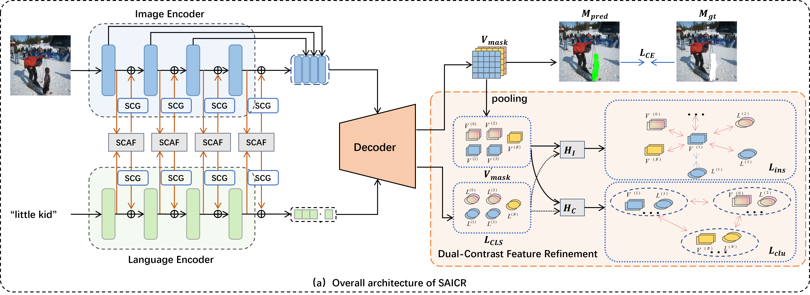

# SAICR
The code of Symmetric Alignment and Intra-class Contrastive Refinement for Referring Image Segmentation



# Datasets

```text
.{YOUR_REFER_PATH}
├── refcoco
├── refcoco+
├── refcocog
└── refcocom

.{YOUR_COCO_PATH}
└── train2014
```
