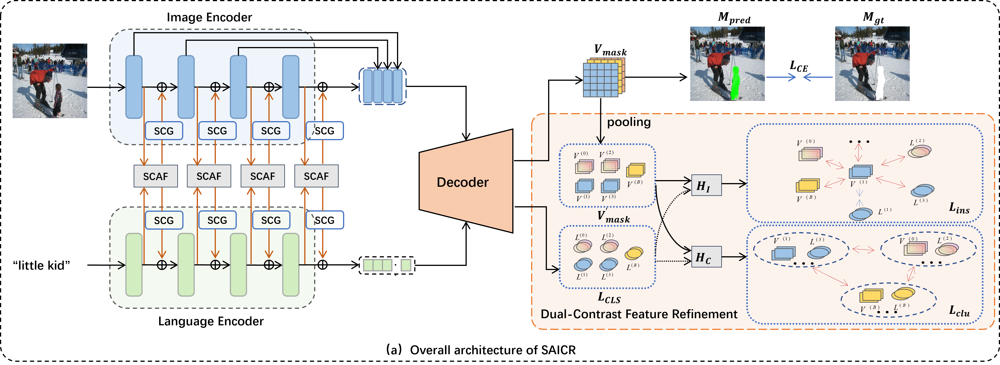

# SAICR
Symmetric Alignment and Intra-class Contrastive Refinement for Referring Image Segmentation.

This repository contains the PyTorch implementation of our ICASSP 2026 paper



Referring Image Segmentation aims to precisely segment a specific object within an image based on a natural language description. However, existing methods often suffer from imprecise visual-language alignment due to suboptimal cross-modal interactions and struggle to distinguish similar distractors because of insufficient feature discriminability. To address these challenges, we propose the Symmetric Alignment and Intra-class Contrastive Refinement (SAICR) framework. For more precise alignment, we achieve multi-level feature fusion in the encoder stage through a bidirectional interaction module, composed of a Symmetric Cross-Attention Fusion (SCAF) module and a Spatial-Channel Gating (SCG) module. For discriminating intra-class objects, we introduce a Dual Contrastive Feature Refinement (DCFR) module, which is the first to apply the idea of Contrastive Clustering to this task, enhancing the model’s discriminative power by combining instance-level and cluster-level learning. Extensive experiments demonstrate that SAICR outperforms existing SOTA methods on three public benchmarks.

# Requirements
The code is verified with Python 3.8 and PyTorch 1.11. Other dependencies are listed in `requirements.txt`.

# Datasets
Download images from [COCO](https://cocodataset.org/#download). Please use the first downloading link *2014 Train images [83K/13GB]*, and extract the downloaded `train_2014.zip` file.

Data paths should be as follows:

```text
.{YOUR_REFER_PATH}
├── refcoco
├── refcoco+
└── refcocog

.{YOUR_COCO_PATH}
└── train2014
```

# Pretrained Models

Download pretrained [Swin-B](https://github.com/SwinTransformer/storage/releases/download/v1.0.0/swin_base_patch4_window7_224_22k.pth) and [BERT-B](https://huggingface.co/bert-base-uncased/tree/main). 

Download SAICR model weights using links below and put them in `./RESUME_PATH`.

| [RefCOCO](https://huggingface.co/lsy200000/SAICR/tree/main) | [RefCOCO+](https://huggingface.co/lsy200000/SAICR/tree/main) | [G-Ref (UMD)](https://huggingface.co/lsy200000/SAICR/tree/main) | [G-Ref (Google)](https://huggingface.co/lsy200000/SAICR/tree/main) |
|---|---|---|---|

# Usage
## Train
By default, we use fp16 training for efficiency. To train a model on refcoco with 1 GPUs, modify `YOUR_COCO_PATH`, `YOUR_REFER_PATH`, `YOUR_MODEL_PATH`, and `YOUR_CODE_PATH` in `scripts/train_refcoco.sh` then run:
```
sh scripts/train_refcoco.sh
```
You can change `DATASET` to `refcoco+`/`refcocog` for training on different datasets. 
Note that for RefCOCOg, there are two splits (umd and google). You should add `--splitBy umd` or `--splitBy google` to specify the split.

## Test
Single-GPU evaluation is supported. To evaluate a model on refcoco, modify the settings in `scripts/test_refcoco.sh` and run:
```
sh scripts/test_refcoco.sh
```
You can change `DATASET` and `SPLIT` to evaludate on different splits of each dataset. 
Note that for RefCOCOg, there are two splits (umd and google). You should add `--splitBy umd` or `--splitBy google` to specify the split. 

# Results
The evaluation results (those reported in the paper) of SAICR trained with a cross-entropy loss are summarized as follows:

|     Dataset     | P@0.5 | P@0.6 | P@0.7 | P@0.8 | P@0.9 | Overall IoU | Mean IoU |
|:---------------:|:-----:|:-----:|:-----:|:-----:|:-----:|:-----------:|:--------:|
| RefCOCO val     | 88.52 | 85.71 | 81.13 | 71.50 | 40.65 |    75.50    |   78.02  |
| RefCOCO test A  | 91.23 | 89.32 | 84.41 | 74.77 | 41.03 |    78.37    |   79.89  |
| RefCOCO test B  | 84.20 | 80.88 | 76.13 | 66.87 | 41.49 |    72.13    |   75.12  |
| RefCOCO+ val    | 80.80 | 78.32 | 74.18 | 65.62 | 37.76 |    67.70    |   71.60  |
| RefCOCO+ test A | 86.60 | 84.61 | 80.44 | 70.49 | 38.77 |    73.33    |   76.15  |
| RefCOCO+ test B | 73.04 | 69.69 | 65.35 | 57.11 | 35.32 |    59.73    |   65.32  |
| G-Ref val (UMD) | 79.94 | 76.51 | 70.89 | 61.05 | 34.15 |    66.43    |   70.59  |
| G-Ref test (UMD)| 80.23 | 76.77 | 71.21 | 61.15 | 34.25 |    67.93    |   70.76  |
|G-Ref val (Goog.)| 77.50 | 74.74 | 70.17 | 61.38 | 35.51 |    64.38    |   68.63  |

# References
This repo is mainly built based on [LAVT](https://github.com/yz93/LAVT-RIS) and [CARIS](https://github.com/lsa1997/CARIS) and [CC](https://github.com/Yunfan-Li/Contrastive-Clustering). Thanks for their great work!


